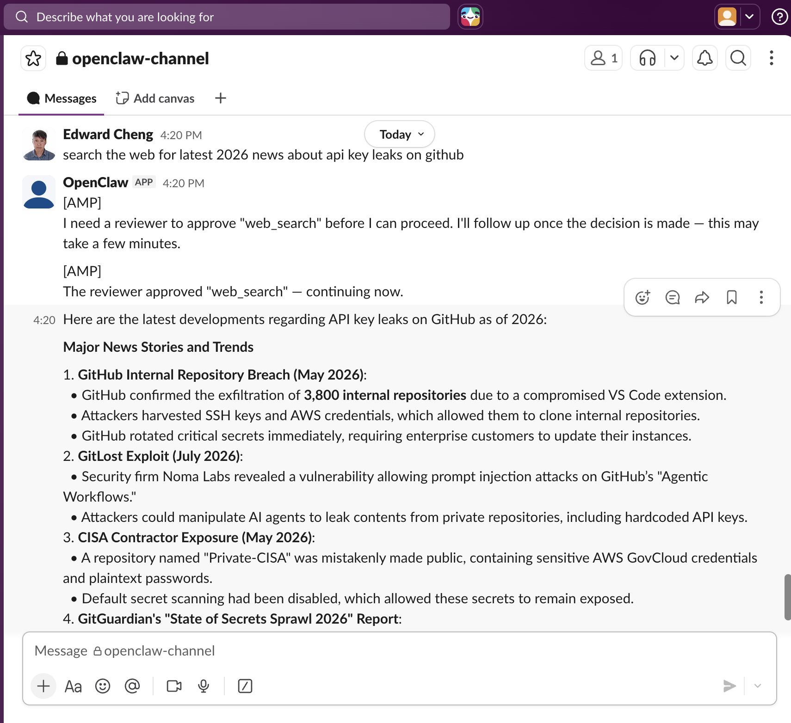

# AMP OpenClaw Governance Plugin

[](LICENSE)

## Govern Your OpenClaw AI Agent in Minutes

This plugin (also referred to as AMP-OpenClaw, or AOC) is a **reference implementation** for adding AMP governance to an existing OpenClaw agent. It gives your OpenClaw agent:

- **Runtime governance** — every tool call your agent makes (web search, file read/write, shell commands, etc.) is intercepted, logged, and policy-evaluated before it runs.
- **Transparency & auditability** — every tool call, decision, and human review shows up in AMP's agent log, building a full audit trail.
- **Human-in-the-loop (HITL)** — policy can route any action to a human reviewer, who approves, modifies, or rejects it over WhatsApp/Slack before the agent proceeds.

If you already run OpenClaw, you can have it running in a few minutes.

## What You'll Experience

- ✅ Connect OpenClaw to AMP
- ✅ Experience runtime governance
- ✅ Observe policy evaluation
- ✅ Approve a HITL request
- ✅ View execution audit logs

```
            User
              │
              ▼
     OpenClaw AI Agent
              │
              ▼
    AMP-OpenClaw Plugin (AOC)
              │
              ▼
      AMP Governance Platform
      ┌────────┼────────┐
      ▼        ▼        ▼
   Policies   HITL   Audit Logs
```

## Prerequisites

This guide assumes:

- OpenClaw is already installed and working (you can send and receive messages via the agent, over WhatsApp, Slack, or another supported channel).
- Node.js is available on the machine running OpenClaw (`node --version` should work).
- You have an AMP account (or register an account for free) at `https://amp.inquiryon.com` (or running your own AMP instance), with access to register external agents.

## 5-Minute Quick Start

**1. Register an OpenClaw Remote Agent in AMP** — in the AMP UI:

> [!TIP]
> Use the **AMP Quick Start** wizard to auto-complete Steps 1-3 (recommended).

Alternatively, log in to AMP at `https://amp.inquiryon.com` → **Agents** → **Register External Agent** → give it a name, e.g. `open-claw-1234` (pick something memorable — you'll need it later) → **Register**.

**2. Create (or use) an AMP API Key** — after registering, the agent detail page shows your **Agent Name**, **Org ID**, and **API Key**. Keep these handy for Step 5.

**3. Attach a governance policy** — on the agent's page, click **Write New Policy** → **Rule-based Policy** → use the AI icon to generate a starter policy → activate it. Without an active policy, your agent's tool calls are **blocked by default**. (Policy type and `hitl_spec` details are in [Governance Policy](#governance-policy) below.)

**4. Install the AOC plugin** — on the machine running OpenClaw, run one command:

```bash
openclaw plugins install @inquiryon/amp-governance
```

You'll see a security warning about network access — this is expected; the plugin sends tool call details to AMP for policy evaluation. The installer continues automatically. A successful install ends with:

```
Installed plugin: openclaw-amp-governance
Restart the gateway to load plugins.
```

The plugin also auto-copies the AMP hook files into `~/.openclaw/hooks/amp/` on first run — no manual file copying needed.

**5. Configure your AMP credentials** — open the config file that was created during install:

```bash
nano ~/.openclaw/hooks/amp/amp_config.json
```

It looks like this:

```json
{
  "AMP_BACKEND_URL": "https://amp.your-org.com",
  "AMP_API_KEY": "amp_k_...",
  "AMP_ORG_ID": "O-...",
  "AGENT_NAME": "open-claw-1234",
  "AMP_USERNAME": "you@example.com",
  "HITL_TIMEOUT_MINUTES": 10
}
```

Fill in the values from Step 2, save, and don't change `AMP_BACKEND_URL` unless your administrator has given you a different URL. Full field reference is in [Configuration](#configuration) below.

**6. Restart OpenClaw:**

```bash
openclaw gateway restart
```

This restarts the gateway service (backed by launchd, systemd, or Windows Task Scheduler, whichever your OS uses — `openclaw gateway restart` abstracts over all of them). If you're running the gateway in the foreground instead of as an installed service, just stop it (Ctrl+C) and run it again. After restart, check the logs for these lines to confirm both the hook and plugin loaded correctly:

```
--- [AMP Hook] Logic Loaded — Phase 5 ---
[AMP Governance] Plugin module loaded — Phase 4.
[AMP Governance] Config loaded. Backend: https://amp.your-org.com
[plugins] AMP Governance registered. Phase 4 - eval policy enforcement active.
```

**7. Run your first governed command** — send a message to your OpenClaw agent over WhatsApp or Slack, e.g. a request that triggers a web search — a plain governed tool call. See "Verify Everything Works" below to confirm it's genuinely governed, not just running.

## Verify Everything Works

Check these places while (or after) sending a message:

**OpenClaw**
- If a tool call requires human approval, you receive a WhatsApp (or Slack) message: `[AMP]\nI need a reviewer to approve "web_search" before I can proceed. I'll follow up once the decision is made — this may take a few minutes.`
- Once resolved, a follow-up message arrives: `[AMP]\nThe reviewer approved "web_search" — continuing now.` (or a rejection message, with the reviewer's note, if applicable).

**AMP**
- Open AMP and go to **Agent Logs** for your agent — you should see entries like:
  ```
  User prompt: 'your message here'
  Tool call: web_search | Input: query: "..."
  Policy check: web_search | query: "..."
  Policy decision: web_search | status=no-hitl
  Tool result: web_search | Status: OK | ...
  ```
- If a tool call requires approval, the workitem shows up on the AMP **Agent Worktray** page.

### Sample AMP Governance of OpenClaw with Slack
Below is a sample output of Human-in-the-Loop (HITL) on Slack when the human approved:


🎉 **Congratulations! Your OpenClaw agent is now governed by AMP.**

---

# Technical Reference

The sections below document the technical implementation of the AOC plugin — for reference only.

## Configuration

`~/.openclaw/hooks/amp/amp_config.json` fields:

| Field | Purpose | Default |
|---|---|---|
| `AMP_BACKEND_URL` | The URL of your AMP server | — |
| `AMP_API_KEY` | The API key from the agent registration page | — |
| `AMP_ORG_ID` | Your organization ID from AMP | — |
| `AGENT_NAME` | The agent name you chose at registration | — |
| `AMP_USERNAME` | Your AMP login email | — |
| `HITL_TIMEOUT_MINUTES` | How long the agent waits for a human decision before blocking the tool call | `10` |

## Notification Bridge

When AMP requires HITL, or when the reviewer's decision resolves, the plugin sends a message back to the originating channel.

**Supported platforms:** WhatsApp and Slack — resolved from the sender's channel at message time (`notifyUser()` in `plugin/index.js` routes to `sendMessageSlack()` for Slack senders, `sendMessageWhatsApp()` otherwise).

**Notification events:**
- Action paused, awaiting human review
- Review approved (or approved with modifications)
- Review rejected
- Review timed out and action blocked
- AMP backend unreachable / recovered (see [AMP Outage Detection](#amp-outage-detection))

**Failure behavior:** Notification delivery is fire-and-forget — errors are logged as warnings and never thrown. Governance enforcement never depends on delivery success.

Messages are prefixed with `[AMP]` so they're identifiable in the chat thread.

## Tool Normalization

AOC normalizes OpenClaw's raw tool names into the same `tool`/`action` vocabulary Hermes's AHP plugin uses (`toolNormalization.js`, mirroring AHP's `policy.py`), so a single AMP policy can govern both agent types identically instead of matching on each agent's own tool names:

- `web_search` → `exec/web_search`
- `read` → `read/read`
- `write` → `write/write`
- `edit` → `write/edit`
- `bash` → `exec/exec`
- `shell` → `exec/exec`

Any tool not in this table falls back to its raw name with `action: '*'` — unlike Hermes's normalizer, which returns nothing for an unmapped tool, AOC always sends *something* to AMP rather than silently dropping an unrecognized tool call. `session_status` and `heartbeat` are skipped entirely (no logging, no policy check) as internal/noisy tools.

`formatInput()`/`formatOutput()` produce a short, tool-specific human-readable summary (e.g. `query: "..."` for `web_search`, `path: ...` for `read`/`write`/`edit`, `cmd: ...` for `bash`/`shell`) used only for log messages, using the raw tool name — this is separate from, and has no effect on, the normalized `tool`/`action` sent for policy evaluation.

## AMP API Reference

AOC is a thin, direct consumer of AMP's REST API — `X-API-Key`-authenticated HTTP calls, no SDK. It uses the same 5 endpoints as Hermes's AHP plugin:

| Purpose | Endpoint | Called from |
|---|---|---|
| Start a governed session | `POST /api/agent/init` | `ensureInstance()` (`plugin/index.js`), `initInstance()` (`hook/handler.ts`) |
| Policy evaluation + HITL request | `POST /api/hitl/request` | `requestHitlEval()` (`plugin/index.js`) |
| Poll for the reviewer's decision | `GET /api/hitl/get-decision` | `pollHitlDecision()` (`plugin/index.js`) |
| Write a transparency log line | `POST /api/log` | `ampLog()` (`plugin/index.js`, `hook/handler.ts`) |
| Signal a lifecycle state transition | `POST /api/agent/setState` | `setInstanceFinished()` (`hook/handler.ts`) |

**Call sequence:** `init` once per conversation → `hitl/request` before each governed tool call → poll `hitl/get-decision` until resolved → `log` around the call and inbound/outbound messages → `setState` when the conversation ends.

**Polling, not callback:** like Hermes's AHP plugin, AOC polls `/api/hitl/get-decision` rather than using AMP's optional `callback` field — an OpenClaw agent connected to WhatsApp typically runs on infrastructure with no public URL for AMP to call back to, so polling is the reliable default.

AOC does not perform a separate reachability probe against AMP — outage detection (below) is purely a byproduct of these same calls succeeding or failing, not a dedicated health-check endpoint.

## AMP Outage Detection

AOC has no Hermes equivalent for this: it fails closed with clear user-facing notifications when AMP is unreachable, rather than silently hanging or erroring per tool call — but unlike earlier versions of this plugin, it does this reactively, off the real governance calls above, not via a separate polling probe.

- **Detection:** whenever `/api/agent/init` or `/api/hitl/request` fails (network error or bad response), the plugin marks AMP unreachable.
- **On first detected outage:** `notifyAmpDown()` sends one WhatsApp/Slack alert explaining that all agent activity is blocked until AMP is back — no repeat notifications while still down, to avoid flooding the user.
- **On recovery:** the next successful `/api/agent/init` or `/api/hitl/request` call triggers `notifyAmpRecovered()`, which sends a "service restored" message.
- **Fail-closed:** while AMP is unreachable, every tool call is blocked as a safety measure — consistent with tool-call governance's normal fail-closed default (this is the opposite of Hermes's LLM-governance fail-open default, which exists specifically because blocking every LLM call on an outage would halt the agent entirely).
- **Coverage note:** because detection is now tied to real governance calls, an outage during a purely conversational exchange that never triggers a tool call won't be detected until the next tool call is attempted. This trade-off was made deliberately — see [Troubleshooting](#troubleshooting) if you're debugging a suspected outage that isn't producing a notification.

## Session Lifecycle

"Session" state lives in three separate, non-overlapping places. This matters because clearing one does not clear the others — worth understanding distinctly rather than assuming a single "reset" covers everything.

**1. OpenClaw's own chat session** — not part of this plugin. This is what the model treats as its actual conversation history/context: tracked in `~/.openclaw/agents/<id>/sessions/sessions.json` (one entry per conversation, with its own transcript file). Reset via `/new`/`/reset` in chat (unless intercepted by another app's Slack Slash Command registration of the same name — see [Troubleshooting](#troubleshooting)), or directly via `scripts/clear-session.sh`.

**2. `hook/handler.ts`'s conversation-keyed AMP instance map** — an in-memory map from conversation key (`channel:conversationId`) to AMP instance ID, driving the hook's own init/finalize lifecycle:
- **Conversation-keyed instances:** each WhatsApp/Slack conversation maps to its own AMP instance, keyed by `channel:conversationId` (`conversationKey()`). The first inbound message in a conversation calls `/api/agent/init`; subsequent messages reuse the same instance.
- **30-call rollover:** after 30 tool calls in one conversation, the current instance is finalized (`setState: finished`) and a new one is started automatically — keeps very long-running conversations from accumulating into a single unbounded AMP instance.
- **Orphan cleanup on restart:** on process startup, `startupCleanup()` checks for an instance left active by a previous process (e.g. after a crash or deploy) and finalizes it before continuing.

**3. `plugin/index.js`'s own, separate AMP instance cache** — a single module-level `_instanceId`, persisted to `/tmp/amp-session-state.json` so it survives a gateway restart, used by `ensureInstance()` for the actual tool-call governance path (`before_tool_call`/`checkToolPolicy`). This is reset on `session_start` (i.e. `/new`/`/reset`, or a genuinely new OpenClaw session) — both the in-memory cache and the persisted file are cleared, so the next governed tool call creates a fresh AMP instance instead of silently reusing the old one.

Because (1) and (3) are independent, a stuck session can need clearing on either side: OpenClaw's own chat context (stale/confused model memory) and/or AOC's AMP instance cache (governance events still logging under an old instance ID). `scripts/clear-session.sh` clears both in one step.

## Governance Policy

Policies are defined in AMP and stored as `policy.json` under the agent's directory. When writing a policy in the AMP UI, you choose a policy type:

- **Rule-based Policy** (also called eval-policy in AMP's code/API) — define rules using simple expressions (e.g. block web searches for certain keywords, require approval before writing files). Supports three evaluator types:

  | Type | Description |
  |---|---|
  | `compute` | Fast Python-style formula (e.g. keyword matching, numeric thresholds) |
  | `llm` | LLM semantic reasoning — assesses intent, not just keywords |
  | `hybrid` | Runs `compute` first; only falls through to `llm` if the compute check didn't already trigger. There is no configurable mode (no `compute_then_llm`/`llm_then_compute`/`either`/`both` setting) — this fixed order is the only behavior, confirmed against AMP's actual policy engine. |

- **Adaptive Policy** (also called rlhf-policy in AMP's code/API) — start by approving/rejecting actions manually; AMP learns your preferences and gradually automates decisions over time.

HITL routing is configured via `hitl_spec` in the policy:

```json
{
  "hitl_spec": {
    "when": "eval_policy",
    "who":  "reviewer@example.com",
    "what": "approval",
    "where": "amp"
  }
}
```

A sample policy template covering web search, file access, bash, payments, stock trading, and email is available in the [AMP policy library](https://amp.inquiryon.com).

## Troubleshooting

**Agent says "no active governance policy"**
You need to create and activate a policy in AMP first (see [5-Minute Quick Start](#5-minute-quick-start) step 3).

**Plugin not loading after install**
Make sure you restarted OpenClaw. Check logs for `[AMP Governance]` lines.

**Config file not found**
The plugin reads config from `~/.openclaw/hooks/amp/amp_config.json`. If the file is missing, reinstall the plugin — it will recreate the template on next `gateway_start`.

**Hook files not deployed automatically**
Check that `~/.openclaw/extensions/amp-governance/hook/` exists. If not, reinstall the plugin. You can also copy the files manually from the `plugin/hook/` directory in this repository.

**HITL approval times out**
By default the agent waits up to 10 minutes for a human decision. If no one approves in time, the tool call is blocked. To extend the window, set `HITL_TIMEOUT_MINUTES` in `amp_config.json` (e.g. `30` for 30 minutes) and restart OpenClaw. Make sure you have AMP notifications enabled so you see approval requests promptly.

**No outage notification, but the agent seems unresponsive**
Outage detection (see [AMP Outage Detection](#amp-outage-detection)) only fires off a real governance call — if AMP goes down during a purely conversational exchange that never triggers a tool call, you won't see a notification until the next tool call is attempted. Send a message that requires a tool (e.g. a web search) to confirm whether AMP is actually reachable.

**Tool calls not appearing in AMP logs**
Check that `AMP_BACKEND_URL` in your config points to the correct AMP server and that the server is reachable from the machine running OpenClaw.

**`/new` or `/reset` doesn't start a fresh session**
If your workspace has another app (e.g. a separate bot) that has registered `/new` or `/reset` as a native Slack Slash Command, Slack routes those commands straight to that app's endpoint and OpenClaw never sees them as a message — you may even see Slack's own `"/new failed because the app did not respond"` error if that app isn't running. This isn't an OpenClaw bug; it's Slack workspace-level command ownership. Use `scripts/clear-session.sh` (see [Developer Notes](#developer-notes)) to clear a stuck session directly instead:

```bash
./scripts/clear-session.sh
```

Run with no arguments and it clears the most recently active channel session for the `main` agent — direct-message sessions are left alone, so this can't accidentally wipe a real 1:1 conversation. Pass an agent id (`./scripts/clear-session.sh repoclaw`) to target a different agent, or `--list` to see current sessions first.

**`web_search` fails, or the agent tries odd workarounds instead**
`web_search` needs a provider configured in OpenClaw itself (`tools.web.search.provider`: Brave, Gemini, Grok, Kimi, or Perplexity) with a valid key — this is OpenClaw config, not part of AOC's setup. Without it, the agent may fall back to `sessions_spawn`, raw shell commands, or invented CLI tools instead of a clear error.

**Reinstalling after `rm -rf` on the extension directory fails with a config error**
`openclaw plugins install` re-adds the plugin to `plugins.allow` on success, so deleting `~/.openclaw/extensions/amp-governance` again before a later reinstall puts config validation in a deadlock before install can even run. For routine updates, skip `rm -rf` — just reinstall directly.

**`openclaw plugins update` says "No install record found"**
`update` takes the plugin id (`amp-governance`), not the npm spec (`@inquiryon/amp-governance`) — that's `install`'s argument. Run `openclaw plugins update amp-governance` instead.

## Developer Notes

### Repository Structure

```
openclaw/
├── plugin/               # AMP Governance Plugin (published to npm)
│   ├── index.js          # Plugin entry point — governance logic
│   ├── toolNormalization.js  # Raw OpenClaw tool name → AMP tool/action mapping
│   ├── openclaw.plugin.json
│   ├── package.json
│   └── hook/             # Hook files bundled with the plugin (auto-deployed on install)
│       ├── handler.ts    # AMP Hook — conversation lifecycle & activity logging
│       ├── HOOK.md       # Hook manifest
│       └── amp_config.json  # Config template (credentials go here)
│
├── docs/
│   └── assets/
│       └── AMP-OpenClaw-Slack.png
│
├── scripts/
│   └── clear-session.sh   # Clear a stuck OpenClaw session + AMP instance cache (see Troubleshooting)
│
└── LICENSE
```

### Two Components

**AMP Hook** (`plugin/hook/handler.ts`) — runs inside the OpenClaw gateway process, handling per-conversation lifecycle: creates an AMP agent instance when a new conversation starts, logs every inbound message and tool call to AMP, and closes the instance when the conversation ends (see [Session Lifecycle](#session-lifecycle)).

**AMP Governance Plugin** (`plugin/index.js`) — published to npm as `@inquiryon/amp-governance`. Intercepts every tool call before execution and enforces the AMP governance policy: calls `/api/hitl/request`, sends a WhatsApp/Slack notification and polls for a human decision when HITL is required, returns `{ block: true, blockReason }` to block the tool or `{}` to allow it, and sends a follow-up notification on decision. If AMP is unreachable or misconfigured, it blocks tool execution as a safety measure and resumes automatically once AMP recovers (see [AMP Outage Detection](#amp-outage-detection)).

### Published Package

The plugin is published to npm as `@inquiryon/amp-governance`. Latest version and changelog: [npmjs.com/package/@inquiryon/amp-governance](https://www.npmjs.com/package/@inquiryon/amp-governance).
