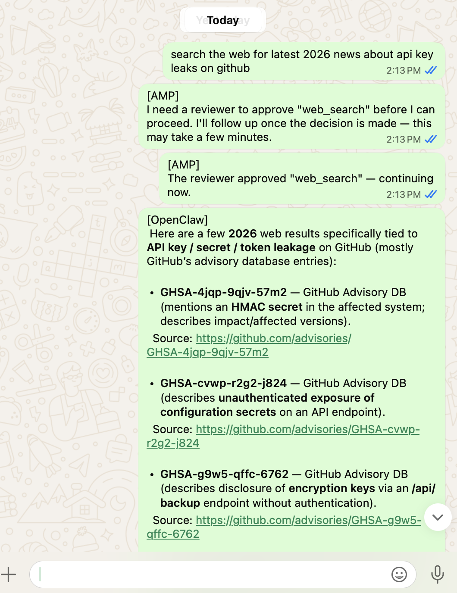

# AMP Governance Plugin — Setup Guide

Integrate your OpenClaw agent with the **Inquiryon AMP (Agent Management Platform)** to get full governance over what your AI agent can and cannot do: activity logging, audit trails, policy-based controls, and human-in-the-loop (HITL) approvals.

---

## What You Get

- **Transparency** — every tool call your agent makes is logged in AMP.
- **Policy enforcement** — define rules for which tools require human approval.
- **HITL approvals** — sensitive actions pause and wait for you or someone you assigned to approve, modify, or reject them before the agent proceeds.
- **Audit trail** — a full history of every agent action, decision, and human review.

---

## Prerequisites

- OpenClaw installed and working (you can send and receive WhatsApp messages via the agent).
- An AMP account with access to register external agents.
- Node.js available on the machine running OpenClaw (`node --version` should work).

---

## Step 1 — Register Your OpenClaw Agent in AMP

1. Log in to the AMP web console at `https://amp.inquiryon.com`.
2. Go to **Agents** and click **Register External Agent**.
3. Give your agent a name, e.g. `open-claw-1234`. Pick something memorable — you will need this name later.
4. After registration, note down these values from the agent detail page:
   - **Agent Name** — e.g. `open-claw-1234`
   - **Org ID** — e.g. `O-0011-AB20260120090030`
   - **API Key** — e.g. `amp_k_...`

Keep these handy for Step 3.

---

## Step 2 — Install the AMP Governance Plugin

This plugin enforces governance policies — it intercepts tool calls before they execute, checks whether they need human approval, and sends you a WhatsApp notification while it waits for a decision.

Run this command:

```bash
openclaw plugins install @inquiryon/amp-governance
```

You will see a security warning about network access — this is expected. The plugin sends tool call details to AMP for policy evaluation. The installer will continue automatically.

A successful install ends with:

```
Installed plugin: openclaw-amp-governance
Restart the gateway to load plugins.
```

The plugin also automatically copies the AMP hook files into `~/.openclaw/hooks/amp/` on first run, so no manual file copying is needed.

---

## Step 3 — Configure Your AMP Credentials

Open the config file that was created during install:

```bash
nano ~/.openclaw/hooks/amp/amp_config.json
```

It looks like this:

```json
{
  "AMP_BACKEND_URL": "https://amp.your-org.com",
  "AMP_API_KEY": "amp_k_...",
  "AMP_ORG_ID": "O-...",
  "AGENT_NAME": "open-claw-1234",
  "AMP_USERNAME": "you@example.com",
  "HITL_TIMEOUT_MINUTES": 10
}
```

Fill in the values you collected in Step 1:

| Field | What to put here |
|---|---|
| `AMP_BACKEND_URL` | The URL of your AMP server — leave this unchanged unless told otherwise |
| `AMP_API_KEY` | The API key from the agent registration page |
| `AMP_ORG_ID` | Your organization ID from AMP |
| `AGENT_NAME` | The agent name you chose in Step 1, e.g. `open-claw-1234` |
| `AMP_USERNAME` | Your AMP login email |
| `HITL_TIMEOUT_MINUTES` | How long (in minutes) the agent waits for a human decision before blocking the tool call. Default is `10`. Increase this if your reviewers need more time to respond. |

Save the file. Do not change `AMP_BACKEND_URL` unless your administrator has given you a different URL.

---

## Step 4 — Restart OpenClaw

```bash
openclaw restart
```

Or if you run OpenClaw as a service, restart it via your process manager (e.g. `pm2 restart openclaw` or `systemctl restart openclaw`).

After restart, check the logs for these lines to confirm both the hook and plugin loaded correctly:

```
--- [AMP Hook] Logic Loaded — Phase 5 ---
[AMP Governance] Plugin module loaded — Phase 4.
[AMP Governance] Config loaded. Backend: https://amp.your-org.com
[AMP Governance] AMP Governance registered. Phase 4 - eval policy enforcement active.
```

---

## Step 5 — Define a Governance Policy in AMP

Without a policy, your agent's tool calls will be **blocked by default**. You need at least one active policy before your agent will work.

1. In AMP, go to **Agents** and select your `open-claw-1234` agent.
2. Click **Write New Policy**.
3. Choose a policy type:
   - **Eval Policy** — define rules using simple expressions (e.g. block web searches for certain keywords, require approval before writing files).
   - **RLHF Policy** — start by approving/rejecting actions manually; AMP learns your preferences and gradually automates decisions over time.
4. Save and activate the policy.

Once a policy is active, your agent is fully governed.

---

## Verifying It Works

Send a message to your OpenClaw WhatsApp agent. Then open AMP and go to **Agent Logs** for your agent — you should see entries like:

```
User prompt: 'your message here'
Tool call: web_search | query: "..."
Policy check: web_search | query: "..."
Policy decision: web_search | status=no-hitl
Tool result: web_search | Status: OK | ...
```

If a tool call requires human approval, you will receive a WhatsApp message from the agent notifying you that approval is being sought. The agent waits for the reviewer's decision before proceeding (configurable via `HITL_TIMEOUT_MINUTES`, default 10 minutes).

### Sample AMP Governance of OpenClaw with WhatsApp
Below is a sample output of Human-in-the-Loop (HITL) on WhatsApp when the human approved:


---

## Troubleshooting

**Agent says "no active governance policy"**
You need to create and activate a policy in AMP first (see Step 5).

**Plugin not loading after install**
Make sure you restarted OpenClaw. Check logs for `[AMP Governance]` lines.

**Config file not found**
The plugin reads config from `~/.openclaw/hooks/amp/amp_config.json`. If the file is missing, reinstall the plugin — it will recreate the template on next `gateway_start`.

**Hook files not deployed automatically**
Check that `~/.openclaw/extensions/openclaw-amp-governance/hook/` exists. If not, reinstall the plugin. You can also copy the files manually from the `hook/` directory in the [plugin repository](https://github.com/inquiryon/openclaw-amp-governance).

**HITL approval times out**
By default the agent waits up to 10 minutes for a human decision. If no one approves in time, the tool call is blocked. To extend the window, set `HITL_TIMEOUT_MINUTES` in `amp_config.json` (e.g. `30` for 30 minutes) and restart OpenClaw. Make sure you have AMP notifications enabled so you see approval requests promptly.

**Tool calls not appearing in AMP logs**
Check that `AMP_BACKEND_URL` in your config points to the correct AMP server and that the server is reachable from the machine running OpenClaw.
